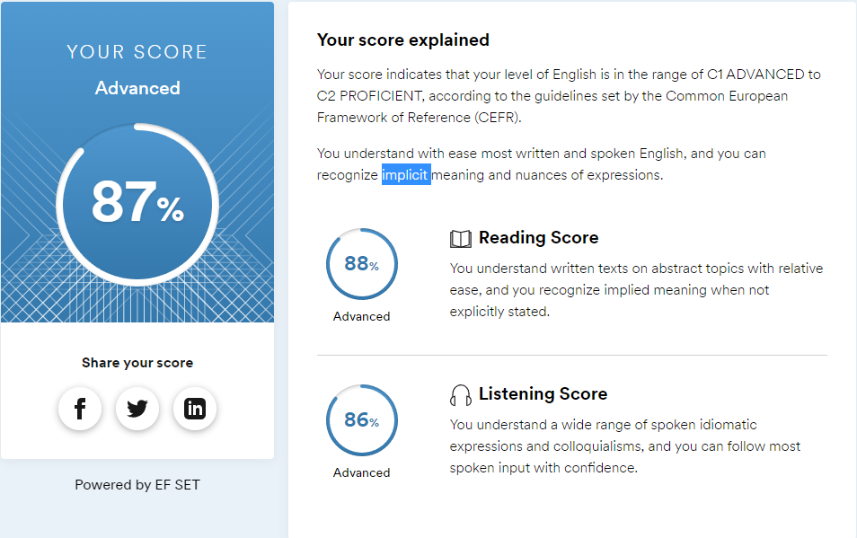

# Ivan Dyadyura
## Frontend developer

***

### Contact info
* Email - jovan226@mail.ru
* Discord - jovan#3520
* Github - https://github.com/jovan-developer

***

### About me

I started my career as an html developer almost 3 years ago.
2 years of freelance, custom website development.
I've been working for the company for the last year.

But the results of my work do not satisfy me, and I decided to study as a React developer.

***

### Skills

* HTML and CSS
* SASS (SCSS)
* Gulp (webpack for JS)
* Javascript
* Vue JS 2,3 (basic knoweledges and some commercial experience)
* Git, Github (Have experience working in a team)
* BEM methodology

***
### Code examples
#### Array.diff

Your goal in this kata is to implement a difference function, which subtracts one list from another and returns the result.

It should remove all values from list a, which are present in list b keeping their order.

```
function arrayDiff(a, b) {
  let resArr = a;

  for (let i = 0; i < b.length; i++) {
    for (let k = 0; k < a.length; k++) {
      if (resArr.find(el => el === b[i])) {
        let index = resArr.indexOf(b[i]);
        resArr.splice(index, 1);
      }
    }
  }

  return resArr;
}
``` 
***

### Education

* Took HTML and CSS courses almost 3 years ago
* Work in Frilance about 2 years
* I've been working for the company for the last year as frontend dev (vue and html + css)

***

### Languages

* __Russian__ - native speaker
* __English__ - A2 or B1. Advanced (C1) - (according to the online test at EFset www.efset.org)
